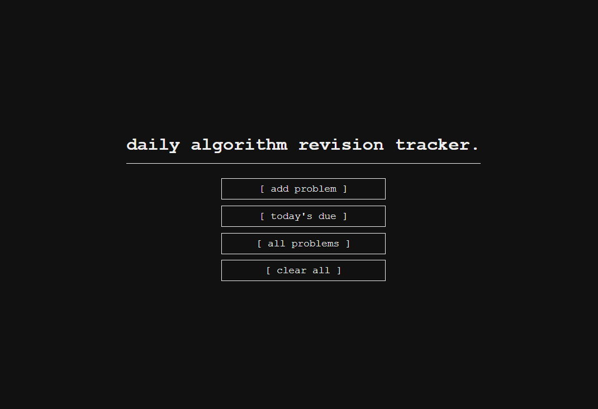

# 🎯 DART — Daily Algorithm Revision Tracker

Hey there 👋. This is **DART**, a simple web app I made to track my daily algorithm problem revisions using spaced repetition.

No accounts, no frameworks, no backend. Just clean HTML, CSS, and JavaScript with local storage. It lets you:

- Add problem numbers you’ve solved
- See which ones are due for revision (after 1, 3, 7, or 14 days)
- Check them off for the day
- Toggle between light and dark mode
- Works offline because everything's saved in your browser

## Why?

I kept forgetting which LeetCode problems to review, and other tools felt too bloated. So I built my own clean and minimal version.

## Live Demo

Try it here: [https://darttracker.netlify.app/](https://darttracker.netlify.app/)

## Tech Used

- HTML
- CSS
- Vanilla JavaScript
- Local Storage API

## Screenshot

## License

MIT. Use it, modify it, share it, whatever. Check [LICENSE](LICENSE) for the details.

## Contributing

Not actively asking for it, but if you find a bug or have an idea, feel free to open an issue or a pull request.

## Made by

**[Reaper](https://github.com/reaperggs)**

